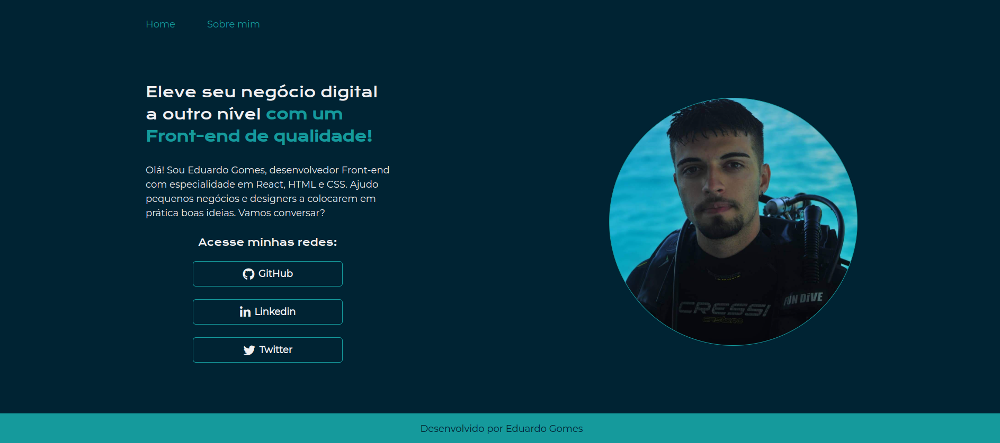

<h1 align="center"> Curso HTML/CSS - Alura </h1>

Aplicando os conhecimentos obtidos através do curso de HTML e CSS da Alura, para criar um portfólio de um desenvolvedor de software, neste projeto utilizamos os conceitos de responsividade e medidas relativas.

  

                                                                            

## 🚀 Tecnologias

Esse projeto foi desenvolvido com as seguintes tecnologias:

- HTML and CSS
- Git and Github

## 💻 Projeto

O portfólio é um projeto que foi desenvolvido para que os profissionais do mercado de trabalho esbocem suas informações de maneira eficaz.